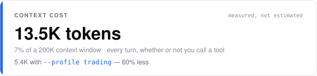
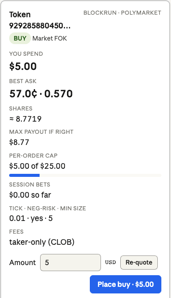
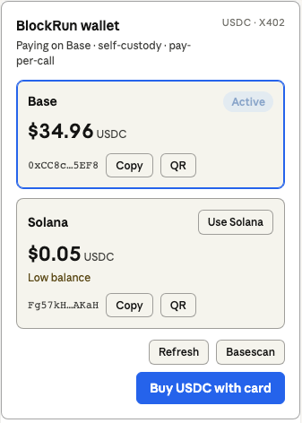

<div align="center">

<h1>BlockRun MCP</h1>

<h3>Real-time data — and real trades — for Claude and any AI agent.</h3>

<p>Agents can't sign up for accounts. Agents can't enter credit cards.<br>
Agents can only sign transactions.<br><br>
<strong>BlockRun MCP gives your agent <!-- br:mcp.tools -->20<!-- /br:mcp.tools --> tools — markets, research, web search, images, video, on-chain data, and live Polymarket trading — paid per call.</strong><br><br>
<strong>Two ways to pay, same tools:</strong> a self-custody <strong>wallet</strong> (USDC on Solana or Base, no account needed) — or a <strong>BlockRun API key</strong> for teams that can't run wallets. <a href="https://user.blockrun.ai">Sign up at user.blockrun.ai →</a><br><br>
<em>Read the odds <strong>and</strong> place the bet, from one self-custody wallet.</em></p>

<br>

&nbsp;
&nbsp;
&nbsp;
&nbsp;
&nbsp;


[](https://www.npmjs.com/package/@blockrun/mcp)
[](https://www.npmjs.com/package/@blockrun/mcp)
[](https://github.com/BlockRunAI/blockrun-mcp)
[](https://github.com/BlockRunAI/blockrun-mcp/actions)
[](https://www.typescriptlang.org)
[](https://nodejs.org)
[](LICENSE)

[](https://modelcontextprotocol.io)
[](https://x402.org)
[](https://base.org)
[](https://solana.com)
[](https://t.me/blockrunAI)

</div>

```bash
claude mcp add blockrun -s user -- npx -y @blockrun/mcp@latest
```

<div align="center"><em>Wallet auto-created on first run. Fund with $5 USDC — or set <code>BLOCKRUN_API_KEY</code> and skip the wallet entirely. Ask Claude anything.</em></div>

<div align="center">
  <picture>
    <source media="(prefers-color-scheme: dark)" srcset="assets/context-cost-dark.svg">
    
  </picture>
</div>

<div align="center"><sub>Every MCP server costs you this. Almost none of them tell you. <a href="docs/mcp-schema-overhead.md">How we measure it, and how to measure anyone else →</a></sub></div>

---

> **BlockRun MCP** is an open-source [Model Context Protocol](https://modelcontextprotocol.io) server that gives Claude — and any MCP-compatible agent — <!-- br:mcp.tools -->20<!-- /br:mcp.tools --> tools for real-time data and real actions: <!-- br:models.chatVisible -->76<!-- /br:models.chatVisible --> LLMs, image & video generation, prediction-market data, live web/X search, on-chain queries across <!-- br:chains.rpc -->40<!-- /br:chains.rpc --> chains, and **the ability to place real, USDC-settled bets on Polymarket**.

You pay per call, and you choose how. **Wallet mode** authenticates with a signature and settles each call in USDC via the [x402](https://x402.org) protocol — no account, no credit card, no subscription, on Solana or Base. **Account mode** authenticates with a BlockRun API key (`brk_live_…`) from [user.blockrun.ai](https://user.blockrun.ai) and bills prepaid credit at exact usage — for teams that can't hand a wallet to an agent. Same 20 tools either way. MIT licensed.

## 🏆 First of its kind — the signal → trade loop in Claude Code

Read live Polymarket odds *and* place the bet, from one self-custody wallet, pay-per-call. [Jump to Polymarket trading →](#-polymarket-trading)

---

## Why BlockRun MCP exists

Every other data integration was built for **human developers** — create an account, copy an API key into `.env`, add a credit card, repeat for every vendor.

**Agents can't do any of that.** BlockRun MCP is built for the agent-first world:

- **One wallet, every source** — <!-- br:mcp.tools -->20<!-- /br:mcp.tools --> tools behind a single self-custody wallet. No per-vendor signups.
- **No API key required** — your wallet signature *is* authentication. (One is available at [user.blockrun.ai](https://user.blockrun.ai) for teams who need an invoice instead of a keypair.)
- **No credit cards** — pay per request in USDC via [x402](https://x402.org), fractions of a cent each.
- **Starts free** — the free tier (`blockrun_chat mode:"free"`, `blockrun_dex`, crypto `blockrun_price`, `blockrun_models`) costs $0.
- **Reads *and* acts** — most tools deliver data; `blockrun_polymarket` places real, confirm-gated trades.
- **Human-in-the-loop payments** — turn on `BLOCKRUN_CONFIRM_SPEND=on` and the agent pauses before any paid call above your threshold; nothing is signed until you approve. [Details ↓](#%EF%B8%8F-human-in-the-loop-payments)
- **Generative UI** — on Claude Desktop, claude.ai, VS Code and Cursor the Polymarket preview is a live order card with a Place button, and the wallet is a panel with balances, QR and card top-up. [MCP Apps ↓](#-mcp-apps-order-card--wallet-panel)
- **Self-custody** — your key never leaves your machine (`~/.blockrun/.session`, `0600` — or the OS keychain once you opt into `BLOCKRUN_KEYCHAIN=strict`). BlockRun can't move your funds.

---

## How it compares

|                     | Raw provider APIs                | Typical single-vendor MCP | **BlockRun MCP**                          |
| ------------------- | -------------------------------- | ------------------------- | ----------------------------------------- |
| **Setup**           | Account + API key *per vendor*   | Account/key for 1 vendor  | **Wallet auto-created — or one key for everything** |
| **Payment**         | Credit card, monthly minimums    | Credit card / vendor plan | **USDC per-call via x402, or prepaid credit** |
| **Data sources**    | One per integration              | One vendor                | **<!-- br:mcp.tools -->20<!-- /br:mcp.tools --> tools — LLMs, media, markets, chain**|
| **Place real bets** | Build it yourself                | Rare                      | **Yes — Polymarket CLOB, confirm-gated**  |
| **Pay-chain**       | —                                | —                         | **Solana + Base (or no chain at all)**    |
| **Agent budgets**   | Manual                           | —                         | **Built-in per-agent delegation**         |
| **Spend approval**  | —                                | —                         | **Ask-before-pay dialog (MCP elicitation)** |
| **Generative UI**   | —                                | Rare                      | **Order card + wallet panel (MCP Apps)**  |
| **Open source**     | Varies                           | Varies                    | **Yes (MIT)**                             |

✓ One wallet · ✓ Pay-per-call · ✓ Reads **and** trades · ✓ Multi-chain · ✓ Agent-ready · ✓ Open source

---

## What changes

Before BlockRun, Claude can't answer:

- *"What's the current Polymarket probability that Bitcoin hits $100k this year?"*
- *"Find me the top 5 papers on RAG published in the last 30 days."*
- *"What are people saying about @sama on X right now?"*
- *"What's the 24h volume on the PEPE/ETH pair on Uniswap?"*
- *"Polymarket has the Fed holding at 73% — put $2 on it."* ← and now it can **place the trade**, not just read the odds.

After BlockRun, it can. Each query costs fractions of a cent — billed from a local USDC wallet, or from prepaid credit on a [BlockRun account](https://user.blockrun.ai). No subscriptions, no per-vendor signups.

---

## Quick Start

### 0. Choose how you pay

|  | **Wallet** *(default)* | **API key** |
|---|---|---|
| Setup | Nothing — a wallet is created on first run | Sign in at [user.blockrun.ai](https://user.blockrun.ai), mint a key |
| Funding | Send USDC (Solana or Base) | Card / wire → prepaid credit |
| Billing | Per call, settled on-chain, + $0.001 network fee | Post-paid at **exact** usage, no per-call fee, no minimum |
| Identity | A keypair on your machine | An account with members and an invoice |
| Best for | Agents, solo devs, anything self-custody | Teams, companies, anyone who can't run a wallet |
| Trade on Polymarket | ✅ | ❌ — needs a keypair to sign |

Both modes reach the same <!-- br:mcp.tools -->20<!-- /br:mcp.tools --> tools. You can switch at any time; setting `BLOCKRUN_API_KEY` takes priority over a wallet, and unsetting it hands the wallet back.

### 1. Install

**Claude Code (recommended)**

```bash
claude mcp add blockrun -s user -- npx -y @blockrun/mcp@latest
```

`-s user` installs globally (available in every project). The `--` separator ensures `-y` is passed to `npx`, not parsed by `claude mcp add`.

> 💡 **Homebrew / nvm users:** if the server doesn't connect, Claude Code likely can't find `node`/`npx` on its launcher PATH. Pass your shell PATH through — works on CLI and desktop:
> ```bash
> claude mcp add blockrun -s user -e PATH="$PATH" -- npx -y @blockrun/mcp@latest
> ```
> See [Troubleshooting](#troubleshooting) if it persists.

**Every MCP client** — one command or one JSON block. *Verified* = we ran the published package on that client and saw the tools listed (client version · date). *Documented* = install path from the client's own docs; not run by us yet — tell us if it works. The **Spend dialog** column is whether the client renders the [human-in-the-loop payment prompt](#%EF%B8%8F-human-in-the-loop-payments); on ❌ clients paid calls proceed without asking and `BLOCKRUN_BUDGET_LIMIT` is the guard.

| Client | Status | Spend dialog | Install |
|---|---|---|---|
| **Claude Code** | ✅ Verified · 2.1.251 · 2026-08-30 | ✅ | `claude mcp add blockrun -s user -- npx -y @blockrun/mcp@latest` |
| **Codex CLI** | ✅ Verified · 0.142.5 · 2026-08-30 | ❌ | `codex mcp add blockrun -- npx -y @blockrun/mcp@latest` |
| **OpenClaw** | 🟡 In use · 2026.5.2 (from a local build; the `npx` form below is not yet verified) | — not documented | `openclaw mcp set blockrun '{"command":"npx","args":["-y","@blockrun/mcp@latest"]}'` |
| **Claude Desktop** | 📝 Documented | ⚠️ renders; OK reports *cancel* → proceeds | `claude_desktop_config.json` — JSON below |
| **Cursor** | 📝 Documented | ✅ | `~/.cursor/mcp.json` — JSON below |
| **VS Code (Copilot)** | 📝 Documented | ✅ | `code --add-mcp '{"name":"blockrun","command":"npx","args":["-y","@blockrun/mcp@latest"]}'` |
| **Gemini CLI** | 📝 Documented | ❌ | `gemini mcp add -s user blockrun npx -y @blockrun/mcp@latest` |
| **Windsurf** | 📝 Documented | ❌ | `~/.codeium/windsurf/mcp_config.json` — JSON below |

Any other MCP client that can spawn a stdio server works the same way: `command: npx`, `args: ["-y", "@blockrun/mcp@latest"]`. With nvm/Homebrew Node on a JSON-configured client, put the absolute path from `which npx` in `command`. Spend-dialog sources and what "proceeds without asking" means: [`docs/spend-confirmation.md`](docs/spend-confirmation.md).

<details>
<summary><strong>JSON for Claude Desktop, Cursor, Windsurf</strong></summary>

```json
{
  "mcpServers": {
    "blockrun": { "command": "npx", "args": ["-y", "@blockrun/mcp@latest"] }
  }
}
```

| Client | File |
|---|---|
| Claude Desktop | `claude_desktop_config.json` (Settings → Developer → Edit Config) |
| Cursor | `~/.cursor/mcp.json` · Windows `%APPDATA%\Cursor\mcp.json` |
| Windsurf | `~/.codeium/windsurf/mcp_config.json` · Linux `~/.config/.codeium/windsurf/mcp_config.json` · Windows `%APPDATA%\Codeium\windsurf\mcp_config.json` |

Add `"env": { "BLOCKRUN_CONFIRM_SPEND": "on" }` inside the server object to turn on the spend dialog where the client supports it.

</details>

### 2. Choose a tool profile (optional)

Expose a trimmed tool set so the client loads fewer schemas into context. Pass `--profile <name>` (or set `BLOCKRUN_MCP_PROFILE`); omit for the full set.

| Profile | Tools |
|---------|-------|
| `full` *(default)* | everything (<!-- br:mcp.tools -->20<!-- /br:mcp.tools --> tools) |
| `media` | `wallet` `models` `image` `video` `realface` `music` `speech` |
| `trading` | `wallet` `price` `dex` `markets` `surf` `defi` `rpc` `polymarket_read` `polymarket` |
| `research` | `wallet` `models` `chat` `search` `exa` `surf` |
| `chat` | `wallet` `models` `chat` |

```bash
claude mcp add blockrun-trading -s user -- npx -y @blockrun/mcp@latest --profile trading

# Codex CLI
codex mcp add blockrun-trading -- npx -y @blockrun/mcp@latest --profile trading
```

An unknown profile name falls back to `full`. `modal` and `phone` are `full`-profile only.

#### What each profile costs your context

Installing an MCP server spends context on **every turn**, whether or not you call the tools —
the client loads each tool's schema into the model's prompt and re-sends it for the whole session.
Package managers have shown install size for decades. Almost no MCP server shows this. Ours:

| Profile | Tools | Context |
|---------|-------|---------|
| `full` *(default)* | 20 | 12,991 |
| `trading` | 9 | 5,605 |
| `media` | 7 | 5,527 |
| `research` | 6 | 3,075 |
| `chat` | 3 | 1,975 |

Running `--profile trading` instead of the default costs **57% less context** for the same trading
workflow. If you only ever ask about markets, that is the single cheapest change you can make.

Measure it yourself — against us, or against any other stdio MCP server:

```bash
npm i gpt-tokenizer
node scripts/measure-tool-schema.mjs                     # this server, every profile
node scripts/measure-tool-schema.mjs -- npx -y @some/other-mcp-server
```

<details>
<summary>How the number is computed, and why it is a slight under-count</summary>

It counts the **model-visible projection** — `{name, description, input_schema}` per tool, with the
`mcp__blockrun__` prefix the host prepends — because that is what lands in the API `tools` array.
It excludes `annotations`, `_meta` and `outputSchema`, which the host consumes and never forwards
to the model (a further ~3.7% on the wire).

The tokenizer is `o200k_base`. Claude's tokenizer is not public and runs a few percent higher on
JSON, so **every figure here is a slight under-count**, never an over-count.

Two caveats worth stating plainly. Tool schemas sit at the front of the prompt and are covered by
prompt caching, so after the first turn they re-send at cache-read rates — the *context-window*
cost is 100% every turn, the *dollar* cost is roughly a tenth of that. And 54% of our own cost is
tool **descriptions**, not schemas, which is where the remaining work is.

</details>
For a complete live signal → order-preview presentation, use
[`skills/signal-to-trade-demo/SKILL.md`](skills/signal-to-trade-demo/SKILL.md)
with the [Stanford runbook](docs/stanford-trading-demo.md).

### 3. Add funds

**Option A — API key (no wallet).** Sign in at **[user.blockrun.ai](https://user.blockrun.ai)** with Google, then:

1. **[Dashboard → Keys](https://user.blockrun.ai/dashboard/keys)** — mint a key. It looks like `brk_live_…` and is shown once.
2. **[Dashboard → Credits](https://user.blockrun.ai/dashboard/credits)** — top up by card or wire.
3. Point the server at it:

```bash
claude mcp add blockrun -s user -e BLOCKRUN_API_KEY=brk_live_… -- npx -y @blockrun/mcp@latest
```

   Or `export BLOCKRUN_API_KEY=brk_live_…` in the environment the client launches from.

   If your client makes environment variables awkward, write the key to
   **`~/.blockrun/.api-key`** instead (`chmod 600`) — same file directory the
   wallet uses. The environment variable wins when both are present.
4. **[Dashboard → Activity](https://user.blockrun.ai/dashboard/activity)** — every call, priced at exact usage.

Verify with `blockrun_wallet action:"status"` — it reports the account, its real
balance, and what this session has spent:

```
Paying with: BlockRun account API key (no wallet, no chain)

  Account:  acme (ungated)
  Spent to date: $4.5239 (invoiced account — no prepaid ceiling)
  Top up:   https://user.blockrun.ai/dashboard/credits
```

A prepaid account shows `Credit remaining: $12.50 of $50.00 granted` instead. If
the account is blocked, status says so and why *before* you spend a call finding out.

**Option B — wallet (no account).** Run `blockrun_wallet` to see your addresses. New installs default to **Solana**; send USDC (SPL) on Solana from Coinbase (pick "Solana"), Phantom, Solflare, or Backpack. To pay on Base instead: `blockrun_wallet action:"chain" chain:"base"`, then send USDC on Base. Full instructions: [Fund your wallet](#fund-your-wallet).

**$5 covers** ~525 market queries · ~500 Exa searches · ~250 image generations · ~14 Seedance 1.5-pro clips.

### 4. Ask Claude anything

> *"What's Polymarket saying about the next Fed decision? If 'hold' is above 70%, put $2 on it."*

Claude reads the odds with `blockrun_markets` and — with your confirmation — places the trade with `blockrun_polymarket`. One wallet. Gasless. Confirm-gated.

### 5. Install the agent skills (optional)

The package ships 16 skills — which tool answers what, worked examples, and a setup / debug / upgrade trio so the agent can install, troubleshoot and update the server on its own.

```bash
/plugin marketplace add BlockRunAI/blockrun-mcp            # Claude Code
npx -y @blockrun/mcp@latest skills install                 # any project → ./.claude/skills
npx -y @blockrun/mcp@latest skills install --global        # ~/.claude/skills
npx -y @blockrun/mcp@latest skills install --to ~/.codex/skills
```

`skills list` shows what ships; `--only a,b` picks; `--force` refreshes copies after an upgrade.

---

## Demo

> **User:** What's Polymarket saying about the Fed rate decision next month?

> **Claude:** According to Polymarket, the market puts a **73% probability** on the Fed holding rates steady, 24% on a 25bp cut, 3% on a hike. 24h volume: $2.1M. The "Hold" contract last traded at $0.73.
>
> *(via `blockrun_markets` · cost: $0.0095)*

---

> **User:** Polymarket has Hawley at ~13% to announce a 2026 presidential run — put $1 on Yes.

> **Claude:** Done — bought **7.63 shares of Yes at $0.131** ($1.00, market FOK). Real on-chain order, settled in pUSD from your gasless Polymarket deposit wallet; I'm tracking the position now.
>
> *(signal via `blockrun_markets`, trade via `blockrun_polymarket` — one self-custody wallet, gasless · on-chain tx `0x7ca8…`)*

---

## Tools

| Tool | Data source | Cost |
|------|-------------|------|
| `blockrun_chat` | <!-- br:models.chatVisible -->76<!-- /br:models.chatVisible --> LLMs (GPT, Claude, Gemini, DeepSeek, Kimi K3, GLM, NVIDIA free tier, …) with `mode` tier routing | per token |
| `blockrun_image` | Generate: openai/gpt-image-2, gpt-image-1, google/nano-banana(-2/-pro), xai/grok-imagine-image(-pro), zai/cogview-4, bytedance/seedream-5-pro. Edit: img2img, inpaint, fusion. | $0.015–0.15 |
| `blockrun_video` | Sora 2 + xAI Grok Imagine Video + ByteDance Seedance 1.5/2.0-mini/2.0-fast/2.0/2.5 (720p + audio; 4K on 2.0, up to 30s on 2.5); RealFace asset → real-person video | $0.053–0.32/sec charged |
| `blockrun_realface` | Enroll a real person (phone liveness) or AI character (Virtual Portrait) as a `ta_xxxx` asset for Seedance 2.0 / 2.0-fast / 2.0-mini video (not 2.5) | free; $0.01 to enroll |
| `blockrun_music` | MiniMax music generation | per track |
| `blockrun_speech` | ElevenLabs TTS (Flash/Turbo/Multilingual/v3, 8 voices) + ByteDance Seed Audio (prompt-directed) + cinematic sound effects; free voice listing | $0.05–0.10/1k chars |
| `blockrun_price` | Pyth-backed realtime + OHLC — crypto / FX / commodity (free), 12 stock markets (paid) | free or $0.001/call |
| `blockrun_markets` | Polymarket (markets, candles, trades, orderbooks, leaderboards, smart-wallet PnL/clusters, UMA oracle), Kalshi, Limitless, Opinion, Predict.Fun, dFlow, Binance Futures, cross-platform search | $0.0095/query |
| `blockrun_polymarket_read` | Read-only Polymarket positions/open orders plus executable live order previews, separated for MCP clients that enforce tool safety annotations | free |
| `blockrun_polymarket` | **Trade on Polymarket** (CLOB V2): place/cancel real bets, positions, redeem winnings — signed locally, settled in pUSD from a gasless deposit wallet. Confirm-gated, $25/order default cap. [Details ↓](#-polymarket-trading) | free tool; bets are your funds |
| `blockrun_surf` | Surf (asksurf.ai) — 83 endpoints: CEX data, on-chain SQL (13 chains, 80+ tables), 100M+ labeled wallets, Polymarket + Kalshi, social mindshare, news, Surf-1.5 chat with citations | $0.0095/call |
| `blockrun_exa` | Neural web search (Exa) — research, competitors, papers, URL content | $0.01/query |
| `blockrun_search` | Grok Live Search — web + X/Twitter + news with citations | $0.025 × max_results |
| `blockrun_dex` | Live DEX prices via DexScreener | free |
| `blockrun_rpc` | Raw JSON-RPC on <!-- br:chains.rpc -->40<!-- /br:chains.rpc --> chains (Ethereum, Base, Solana, Bitcoin, Sui, NEAR, …) via Tatum | $0.002/call |
| `blockrun_defi` | DefiLlama — protocol TVL, chain TVL, yield pools (APY), token prices | $0.001–0.005/call |
| `blockrun_modal` | Isolated code execution in a BlockRun-hosted Modal sandbox — disposable container, optional GPU (T4 → H100) | $0.01 create; $0.001/op |
| `blockrun_phone` | Outbound AI voice calls (Bland) + wallet-owned US/CA numbers (Twilio), carrier + fraud lookups | $0.54/call; $5/number |
| `blockrun_models` | Live catalogue of every LLM/image/video/music model + pricing | free |
| `blockrun_wallet` | Balance, spending, agent budgets, setup QR, chain switch | free |

---

## Key use cases

1. **Prediction-market consensus** → *"Polymarket's odds for the next Fed decision?"* — `blockrun_markets`
2. **Signal → trade** *(the full loop, self-custody)* → *"If 'hold' is under 30%, put $2 on Yes."* — `blockrun_markets` reads, `blockrun_polymarket action:"buy"` places. Gasless, confirm-gated.
3. **On-chain forensics** → *"This wallet — what's it labeled, what does it hold, when did it whale up?"* — `blockrun_surf`
4. **Cited research** → *"5 most-cited papers on speculative decoding, last 90 days."* — `blockrun_exa`
5. **Image generation with on-image text** → *"Poster announcing GPT-5.5, retro-futuristic, headline 'NOW LIVE'."* — `blockrun_image`
6. **Give your agent a voice** → *"Speak this with the sarah voice."* — `blockrun_speech`
7. **Voice phone-out** → *"Call +1-415-… and confirm Friday at 3pm."* — `blockrun_phone`
8. **Multi-agent research, capped** → *"Spawn 3 agents on competing L1 narratives. Cap each at $0.50."* — `blockrun_wallet delegate × 3`
9. **Cross-chain SQL** → *"Top 10 tokens by DEX volume on Base, last 24h."* — `blockrun_surf` `onchain/sql`

---

## 📈 Polymarket trading

`blockrun_polymarket` lets an agent place **real bets** on [Polymarket](https://polymarket.com) (CLOB V2, Polygon). It is **non-custodial**: every order and approval is EIP-712-signed locally by your BlockRun wallet key — the same self-custody key that pays x402 API fees on Base also authorizes bets on Polygon. Neither BlockRun nor Polymarket's relayer can move funds; they only forward payloads you signed.

**Architecture** — the official "deposit wallet" path (signature type POLY_1271): a smart-contract vault on Polygon, CREATE2-derived from your key (only your key can authorize it), holds betting funds in **pUSD** (Polymarket's 1:1 collateral wrapper). Deployment, approvals, and redemptions all run **gasless** through Polymarket's relayer — you never need POL.

**📖 Full step-by-step guide:** [`docs/polymarket-trading-setup.md`](docs/polymarket-trading-setup.md)

```
# 1. Provision your deposit wallet (idempotent, gasless)
blockrun_polymarket action:"setup"

# 2. Fund it from your Base USDC in one call (gasless; $0.01 fee, non-custodial)
blockrun_polymarket action:"fund" amount_usd:5 confirm:true

# 3. Sign the one-time gasless approval batch
blockrun_polymarket action:"setup" confirm:true

# 4. Find a market, preview safely, then place only after exact user approval
blockrun_polymarket_read action:"preview" side:"buy" token_id:"<id>" amount_usd:5 order_type:"FOK"
blockrun_polymarket action:"buy" token_id:"<id>" amount_usd:5 order_type:"FOK" confirm:true

# 5. Manage → positions · orders · cancel · sell · redeem · withdraw
```

**Safety rails** (server-side; an agent cannot bypass them): `confirm:true` required for every order/approval/redeem, `POLYMARKET_MAX_BET_USD` per-order cap (default $25), optional `POLYMARKET_MAX_SESSION_USD` session cap, and bets never draw from the x402 API budget.

**Regions:** Polymarket geoblocks order placement by IP (US/UK + many regions). **Handled by default** — the MCP routes CLOB traffic through BlockRun's hosted Finland egress (a fully unrestricted region under Polymarket's policy), so trading works out of the box; `setup` reports your status. Override `POLYMARKET_CLOB_HOST` to go direct or run your own egress, optionally reached via `HTTPS_PROXY` / `POLYMARKET_CLOB_PROXY` (a proxy alone doesn't change the Polymarket-facing egress). Complying with Polymarket's terms for your jurisdiction is your responsibility.

> ⚠️ **Back up your signer key** (`~/.blockrun/.session` by default; a `BLOCKRUN_WALLET_KEY` env var or an existing agent `wallet.json` takes precedence — `setup` prints the actual signer address). It is the only key to both the payment wallet and the Polymarket deposit wallet.

---

## 🛡️ Human-in-the-loop payments

Turn on `BLOCKRUN_CONFIRM_SPEND=on` and **every paid tool pauses before it signs**. The server sends an MCP elicitation; your client renders it as a dialog with the estimated charge:

```
💸 BlockRun charge — video · bytedance/seedance-2.5 · 10s
Estimated: $2.6500
Approve this spend? (USDC is debited per call.)
To stop the charge, choose Decline — Cancel/ESC lets it proceed.

[ ] Approve all BlockRun charges for the rest of this session (don't ask again)

                                          [ Decline ]  [ Approve ]
```

**Decline** → nothing is sent, nothing is charged, the tool reports *"Charge declined"*. **Approve** → the call proceeds. Tick the box and you're not asked again for the session. Free calls never prompt. Set `BLOCKRUN_CONFIRM_THRESHOLD=0.05` to only be asked above $0.05.

```bash
claude mcp add blockrun -s user -e BLOCKRUN_CONFIRM_SPEND=on -e BLOCKRUN_CONFIRM_THRESHOLD=0.05 -- npx -y @blockrun/mcp@latest
```

| Client | Dialog | | Client | Dialog |
|---|---|---|---|---|
| Claude Code | ✅ | | Claude Desktop | ⚠️ renders; OK reports *cancel* → proceeds |
| Cursor | ✅ | | Windsurf | ❌ proceeds without asking |
| VS Code Copilot | ✅ | | Codex CLI · Gemini CLI | ❌ proceeds without asking |

On a client that can't ask, the gate **fails open** — the call proceeds and the cost footer reports the charge. The hard stop on every client is the budget: `BLOCKRUN_BUDGET_LIMIT` for the process, `blockrun_wallet action:"delegate"` per sub-agent. `blockrun_polymarket` keeps its own, stronger per-order `confirm:true`.

**📖 When to use it, sources for the matrix, limitations:** [`docs/spend-confirmation.md`](docs/spend-confirmation.md)

---

## 🧩 MCP Apps — order card & wallet panel

On hosts that support the [MCP Apps extension](https://modelcontextprotocol.io/extensions/apps/overview) — Claude Desktop, claude.ai, VS Code, Cursor, ChatGPT — two tools render as interactive cards instead of text. Everywhere else (Claude Code, Codex, terminals) nothing changes.

<p align="center">
  
  &nbsp;&nbsp;&nbsp;
  
</p>

- **Order card** on `blockrun_polymarket_read action:"preview"` — question, outcome, side, best quote, est. shares, notional, cap meter, session ledger. Edit the amount → **Re-quote**. **Place order** is arm-then-confirm and asks the *host* to call `blockrun_polymarket … confirm:true`, so the host's consent prompt and every server cap (`POLYMARKET_MAX_BET_USD`, session cap) still apply.
- **Wallet panel** on `blockrun_wallet` — both chains' balances, switch chain, copy address, EIP-681 / Solana Pay QR, explorer, **Buy USDC with card**.

**📖 Hosts, money path, local testing:** [`docs/mcp-apps.md`](docs/mcp-apps.md)

---

## Fund your wallet

> Paying with an API key instead? There is no wallet to fund — top up credit at **[user.blockrun.ai/dashboard/credits](https://user.blockrun.ai/dashboard/credits)** and skip this section.

The server keeps **two** wallets — one on Solana, one on Base — and pays from one at a time. Run `blockrun_wallet` to see both addresses, balances, and which is active.

$5 covers ~525 market queries, ~500 Exa searches, ~250 image generations, or ~14 Seedance 1.5-pro clips (5s @ 720p+audio, ~$0.35 each).

### Pay on Solana *(default for new installs)*

```
blockrun_wallet action:"setup"    # shows the Solana address + funding QR
```

Send USDC (SPL) on the **Solana** network — from Coinbase (pick "Solana"), Phantom, Solflare, or Backpack.

### Pay on Base

One tool call — no env vars, no file editing, no restart:

```
blockrun_wallet action:"chain" chain:"base"   # provisions + activates the Base wallet
blockrun_wallet action:"setup"                # shows the Base address + funding QR
```

| Method | Steps |
|--------|-------|
| Coinbase | Send → USDC → Base network → paste address |
| Bridge from Ethereum | [bridge.base.org](https://bridge.base.org) |
| Card | `blockrun_wallet action:"deposit"` — Coinbase Onramp, Base only |

Switch back with `blockrun_wallet action:"chain" chain:"solana"`. Switching only changes which wallet pays; both keep their balances.

> **Upgrading from an older version?** Nothing moves. The Solana-first default applies only to installs with no wallet and no saved chain preference — if you already have a Base wallet, you stay on Base until you switch.

### What each mode reaches

Almost everything now settles on either chain. The exceptions:

| Capability | API key | Solana wallet | Base wallet |
|---|:--:|:--:|:--:|
| Chat, image, video, music, speech, RealFace | ✅ | ✅ | ✅ |
| Search, Exa, Surf, markets, RPC, DEX, phone | ✅ | ✅ | ✅ |
| `blockrun_defi` (DefiLlama) | ✅ | ❌ not served on the Solana gateway | ✅ |
| `blockrun_modal` (sandboxes) | ✅ | ❌ not configured on the Solana gateway | ✅ |
| Native Anthropic `claude-*` passthrough | ✅ | ❌ the SDK signs EIP-3009 only | ✅ |
| Polymarket trading | ❌ needs a keypair | ✅ | ✅ |
| `blockrun_wallet` balance / deposit / QR | ❌ no wallet | ✅ | ✅ |
| `blockrun_realface action:"list"` | ❌ indexed by wallet address | ✅ | ✅ |

A blocked capability returns a message naming the fix, not a raw error.

### What a call costs, and how sure we are

| Mode | Reported cost |
|---|---|
| API key — most tools | **The amount actually settled**, read from the account API's per-call response |
| API key — `blockrun_chat` | An estimate. Chat settles *after* the response by design, so no figure exists when the answer is sent |
| API key — `blockrun_image`, paid `blockrun_price` | An estimate, until the SDK surfaces the settled figure on those paths |
| Wallet | The amount signed and settled on-chain, from the 402 quote |

Anything estimated is printed with a `~` and says so. Estimates run **high** on
the account rail — they add a transaction fee it does not charge — so a budget
cap trips early rather than late. The invoice is always
[Dashboard → Activity](https://user.blockrun.ai/dashboard/activity).

---

## For agents & LLMs

> **If you are an LLM invoking BlockRun MCP tools, read these first:**

- **CRITICAL: On any payment / balance / 402 error, call `blockrun_wallet` *first*** to check status, then `action:"setup"` for funding. Don't retry the failing tool blindly — the wallet is empty.
- **CRITICAL: `blockrun_polymarket` moves REAL user funds** (pUSD on Polygon), separate from the x402 API budget. Never `buy`/`sell`/`redeem` with `confirm:true` unless the user explicitly approved that exact trade; without `confirm` you get a safe dry-run. Discover markets/token IDs with `blockrun_markets` first.
- **CRITICAL: `blockrun_surf`'s 84-endpoint catalog is in [`skills/surf/SKILL.md`](skills/surf/SKILL.md); `blockrun_markets`' full endpoint list is in its tool description** (worked examples in [`skills/prediction-markets/SKILL.md`](skills/prediction-markets/SKILL.md); live-demo workflow in [`skills/signal-to-trade-demo/SKILL.md`](skills/signal-to-trade-demo/SKILL.md)). Browse those before guessing paths.
- **CRITICAL: `blockrun_music` and `blockrun_video` are payment-on-completion async.** Failures / client timeouts do NOT charge. Don't retry-loop — they may take 60–180s.
- **CRITICAL: Before spawning child agents, allocate per-agent budget:** `blockrun_wallet action:"delegate" agent_id:"X" agent_limit:1.00`, then pass `agent_id:"X"` to every downstream call. The child is auto-blocked at zero.
- **Free tier first for drafts:** `blockrun_chat mode:"free"` (NVIDIA), `blockrun_dex`, `blockrun_price` (crypto/FX/commodity), and `blockrun_models` are $0.
- **A declined spend confirmation is the user's decision.** Report it and stop — never re-issue the call with a cheaper model, smaller parameters, or split requests to get under their threshold.

---

## Showcase

Posters generated through `blockrun_image` with `openai/gpt-image-2` — each a single API call routed through BlockRun, paid in USDC on Base.

<p align="center">
  
</p>

| | | |
|:---:|:---:|:---:|
|  |  |  |
| **Cornell Blockchain Conference 2026** | **Cornell Blockchain Conference 2026** | **100 Trillion Tokens** milestone |

Prompts and a worked example are in [`skills/image-prompting/SKILL.md`](skills/image-prompting/SKILL.md).

---

## Why not just use the APIs directly?

| | Direct APIs | BlockRun |
|---|---|---|
| Exa | Sign up, $20/mo minimum | $0.01/call, no subscription |
| Polymarket | Undocumented, rate-limited | $0.0095/call, clean JSON — plus you can **trade** |
| Surf (asksurf.ai) | Account + monthly plan | $0.0095/call, no account, 83 endpoints |
| Multiple sources | 3 accounts, 3 API keys, 3 billing pages | **1 wallet** |

One wallet. All sources. No dashboards.

---

## Configuration

<details>
<summary><strong>Environment variables & files</strong></summary>

| Variable / File | Default | Effect |
|---|---|---|
| `BLOCKRUN_API_KEY` | unset | A BlockRun account key (`brk_live_…`) from [user.blockrun.ai/dashboard/keys](https://user.blockrun.ai/dashboard/keys). **Set → account billing: no wallet is created, read or used, and no chain applies.** Takes priority over every wallet setting below. A malformed value is a startup error, never a silent fall back to the wallet. |
| `~/.blockrun/.api-key` | not created | The same key on disk, for clients that make env vars awkward. Read only when `BLOCKRUN_API_KEY` is unset; an empty or unreadable file falls through to wallet mode. |
| `BLOCKRUN_API_BASE_URL` | `https://api.blockrun.ai` | Account API base, for staging. Accepts the OpenAI-style `…/v1` form too. |
| `~/.blockrun/.session` | auto-created on first run | EVM private key (0x…). File exists → use Base. Also the Polymarket signer (unless `BLOCKRUN_WALLET_KEY` or an agent `wallet.json` takes precedence). |
| `BLOCKRUN_WALLET_KEY` | unset | Env override of the EVM key — takes precedence over `.session` / `wallet.json` as the Base + Polymarket signer. |
| `~/.blockrun/.chain` | unset | Explicit chain preference: `base` or `solana`. Written only by `blockrun_wallet action:"chain"` — i.e. only when you choose. |
| `~/.blockrun/.chain-auto` | written on first run | Automatic pin: the chain you were already on when your second wallet was provisioned. Keeps a Base user on Base once a Solana session exists, and is outranked by `SOLANA_WALLET_KEY`. Cleared whenever you set a chain explicitly. |
| `~/.blockrun/.solana-session` | not created | Solana private key. File exists → Solana unless `.chain` says `base`. |
| `SOLANA_WALLET_KEY` | unset | Env override of `.solana-session`. Set → use Solana. |
| `BLOCKRUN_KEYCHAIN` | `auto` | Key storage. `auto` — mirror the key into the OS keychain (macOS Keychain / Linux `secret-tool`) and keep the plaintext file, which stays authoritative so other BlockRun tools keep working and so replacing it still rotates your wallet. `off` — file only. `strict` — also delete `~/.blockrun/.session` once a read-back proves the keychain holds the same key; **this breaks other tools that read that file directly**. |
| `BLOCKRUN_MCP_PROFILE` | `full` | Tool profile (`media` / `trading` / `research` / `chat`). |
| `BLOCKRUN_BUDGET_LIMIT` | unset (unlimited) | Hard USD cap on spend for this server process (both rails). In-memory; resets on restart. Per-agent caps via `blockrun_wallet action:"delegate"`. |
| `BLOCKRUN_CONFIRM_SPEND` | off | `on` — ask before every paid call via MCP elicitation. [Details](#%EF%B8%8F-human-in-the-loop-payments). Fails open on clients without elicitation. |
| `BLOCKRUN_CONFIRM_THRESHOLD` | `0` | Only ask for calls estimated above this many USD. Malformed values fall back to `0` (ask for everything), never to "off". |
| `POLYMARKET_CLOB_HOST` | BlockRun Finland relay | Geoblock egress for order placement — **defaulted for you**. Override to go direct (`https://clob.polymarket.com`) or your own egress. |
| `POLYMARKET_MAX_BET_USD` | `25` | Hard per-order notional cap. |
| `POLYMARKET_MAX_SESSION_USD` | unset | Optional cumulative per-process betting cap. |
| `POLYMARKET_SIG_TYPE` | `3` | `3` = deposit wallet (POLY_1271, gasless); `0` = plain EOA mode. |
| `POLYMARKET_CLOB_PROXY` | unset | HTTPS proxy for Polymarket CLOB traffic only. |
| `POLYMARKET_BOUNDED_APPROVALS` | unset (unlimited) | Bound pUSD exchange allowances to this many dollars. |
| `BLOCKRUN_BUILDER_CODE` | unset | Optional Polymarket builder attribution code carried on orders. |

**Chain selection priority** (`src/utils/wallet.ts`), highest first: `.chain` preference → `SOLANA_WALLET_KEY` → `.chain-auto` pin → non-empty `.solana-session` → Solana key in the OS keychain → **an existing Base wallet keeps Base** → otherwise **Solana** (a fresh install with no wallet at all).

That second-to-last step is the upgrade guard: without it, flipping the default to Solana would move every existing Base-only user onto an empty wallet, and their next paid call would fail on a zero balance with nothing on screen explaining why. None of this applies in account mode — `BLOCKRUN_API_KEY` has no chain.

The server runs a non-blocking npm registry check at startup and prints an `Update available` notice to stderr when a newer `@blockrun/mcp` exists — re-run the install command to upgrade.

</details>

---

## Troubleshooting

> 🤖 Hand this to the agent: the [`blockrun-debug`](skills/blockrun-debug/SKILL.md) skill carries every row below as symptom → cause → fix, plus the diagnostics it can run itself. [`blockrun-setup`](skills/blockrun-setup/SKILL.md) and [`blockrun-upgrade`](skills/blockrun-upgrade/SKILL.md) cover the other two halves. Install: `npx -y @blockrun/mcp@latest skills install`.

- **`Insufficient balance` / HTTP 402 after retry** → Run `blockrun_wallet action:"setup"`, send USDC on Base (or Solana).
- **`blockrun` doesn't connect / "MCP server failed" / `spawn npx ENOENT`** → Almost always a **PATH issue**: Claude Code can't find `node`/`npx` on its launcher PATH (common with Homebrew / nvm, on CLI *and* desktop). Fix by passing your shell PATH at install:
  ```bash
  claude mcp remove blockrun -s user
  claude mcp add blockrun -s user -e PATH="$PATH" -- npx -y @blockrun/mcp@latest
  ```
  Then restart Claude Code. Or pin absolute paths (`which npx`).
- **`claude mcp list` doesn't show `blockrun`** → Check `node -v` (≥20.19). Clear the npx cache: `rm -rf ~/.npm/_npx`. Re-run the install.
- **`fetch failed` / balance-check timeout** → Base RPC transient outage. The tool falls through 3 public RPCs; retry after 30s. Persistent = local proxy / firewall blocking outbound RPC.
- **`Video`/`Music generation timed out`** → Upstream queue congestion. **No charge** (payment-on-completion). Retry, or pick a faster model.
- **No spend-confirmation dialog although `BLOCKRUN_CONFIRM_SPEND=on`** → Your client doesn't support MCP elicitation (Windsurf, Codex, Gemini CLI); the server proceeds without asking by design. Use `BLOCKRUN_BUDGET_LIMIT` as the guard, or a client from the [support table](#%EF%B8%8F-human-in-the-loop-payments).
- **Polymarket: neg-risk ("winner") market buy fails, or `redeem` reverts, though setup shows ready** → Re-run `action:"setup" confirm:true` once (grants the on-chain approvals a pre-upgrade deposit wallet may lack — including the collateral-adapter approvals `redeem` needs). See the [setup guide](docs/polymarket-trading-setup.md).

---

## FAQ

**What is BlockRun MCP?**
An open-source MCP server that gives Claude and other agents <!-- br:mcp.tools -->20<!-- /br:mcp.tools --> tools for real-time data and real actions (trading, media, on-chain), paid per call — from a self-custody wallet or a BlockRun account key.

**Do I need an API key or an account?**
No. A wallet is auto-created locally on first run; you fund it with USDC and there are no signups, dashboards or keys to rotate.

But you *can* have one. If your team can't hand a wallet to an agent, sign in at **[user.blockrun.ai](https://user.blockrun.ai)**, mint a key at [Dashboard → Keys](https://user.blockrun.ai/dashboard/keys), top up at [Dashboard → Credits](https://user.blockrun.ai/dashboard/credits), and set `BLOCKRUN_API_KEY`. You then get post-paid billing at **exact** usage — no $0.001 per-call minimum, no per-call network fee — and a per-call ledger at [Dashboard → Activity](https://user.blockrun.ai/dashboard/activity). Everything works except the parts that genuinely need a keypair: Polymarket trading, wallet balances/top-ups, and the wallet-indexed `blockrun_realface action:"list"`.

**Which is cheaper?**
Account billing, slightly — it charges exact metered usage with no per-call minimum and no $0.001 transaction fee. Wallet mode buys you self-custody and Polymarket trading instead.

**How much does it cost?**
Pay-per-call — fractions of a cent to a few cents. The free tier (`blockrun_chat mode:"free"`, `blockrun_dex`, crypto `blockrun_price`, `blockrun_models`) is $0. $5 of USDC covers thousands of queries.

**Is it safe / non-custodial?**
Yes. Your private key never leaves your machine (`~/.blockrun/.session` by default, `0600`). x402 payments and Polymarket orders are signed locally — BlockRun forwards signed payloads and cannot move your funds.

**Which clients work?**
Any MCP client that can spawn a stdio server. Verified on Claude Code and Codex CLI, in daily use on OpenClaw; install paths documented for Claude Desktop, Cursor, VS Code, Gemini CLI and Windsurf — see the [client table](#1-install). The spend-confirmation dialog additionally needs MCP elicitation (Claude Code, Cursor, VS Code).

**Does it have a UI?**
On MCP-Apps hosts (Claude Desktop, claude.ai, VS Code, Cursor) the Polymarket preview is a live order card and the wallet is a panel — see [MCP Apps ↑](#-mcp-apps-order-card--wallet-panel). Terminal clients get the same information as text.

**Can I make the agent ask before it spends?**
Yes — `BLOCKRUN_CONFIRM_SPEND=on`. Every paid tool pauses with the estimated charge and nothing is signed until you approve. [Human-in-the-loop payments ↑](#%EF%B8%8F-human-in-the-loop-payments)

**Can it really place real bets?**
Yes. `blockrun_polymarket` places real, USDC-settled orders on Polymarket's CLOB — confirm-gated and capped. Read the odds with `blockrun_markets`, place with `blockrun_polymarket`.

**Base or Solana?**
Both. Switch instantly with `blockrun_wallet action:"chain"`. A few media/paid tools settle on Base only (noted above).

---

## From the BlockRun ecosystem

BlockRun is agent-native AI infrastructure — one wallet, x402 USDC micropayments, across every surface:

- **⚡ [ClawRouter](https://github.com/BlockRunAI/ClawRouter)** — the agent-native LLM router for OpenClaw. <!-- br:models.chatVisible -->76<!-- /br:models.chatVisible --> models, <1ms local routing, USDC on Base & Solana.
- **🤖 [BRCC](https://blockrun.ai/brcc.md)** — BlockRun for Claude Code: smart routing + x402 payments, purpose-built for Claude Code.
- **🐍 [ClawRouter-Hermes](https://github.com/BlockRunAI/ClawRouter-Hermes)** — Python plugin wiring NousResearch Hermes into the ClawRouter proxy.
- **📚 [Docs](https://blockrun.ai/docs)** · **[Models & pricing](https://blockrun.ai/models)** — full SDKs, APIs, and the model catalogue.

---

## Support & community

| | |
|---|---|
| 💬 Community Telegram | [t.me/blockrunAI](https://t.me/blockrunAI) |
| 🐦 X / Twitter | [@BlockRunAI](https://x.com/BlockRunAI) |
| 📖 Documentation | [blockrun.ai/docs](https://blockrun.ai/docs) |
| 🐛 Issues | [github.com/BlockRunAI/blockrun-mcp/issues](https://github.com/BlockRunAI/blockrun-mcp/issues) |

---

## Contributing

PRs welcome. See [CONTRIBUTING.md](./CONTRIBUTING.md) for setup, the tool-vs-skill design rule, and how to add a new partner API.

---

<div align="center">

**MIT License** · [blockrun.ai](https://blockrun.ai) — Agent-native AI infrastructure

[Website](https://blockrun.ai) · [npm](https://www.npmjs.com/package/@blockrun/mcp) · [Docs](https://blockrun.ai/docs) · [@BlockRunAI](https://x.com/BlockRunAI)

</div>
